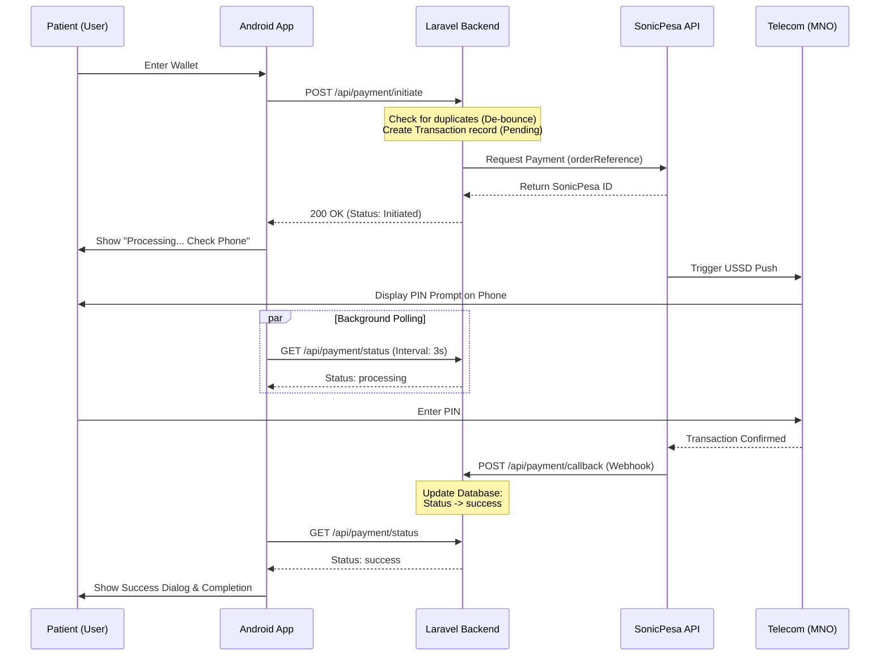

# HASET Payment Logic Flow Documentation

This document describes the end-to-end logic flow of the HASET payment system, integrating the Android Mobile App, Laravel Backend, and SonicPesa Payment Gateway.

## 🏗️ System Architecture

The payment system follows an asynchronous USSD Push (M-Pesa/Tigo Pesa/Airtel Money) model with the following components:

1.  **HASET Android App**: User interface for choosing payment method and wallet number.
2.  **HASET Laravel Backend**: Orchestrates transactions, maintains state in SQLite/MySQL, and interacts with payment providers.
3.  **SonicPesa Gateway**: Aggregator that triggers the actual USSD/STK push to the user's mobile device.
4.  **Mobile Network Operator (MNO)**: Delivers the USSD prompt to the user and handles PIN verification.

---

## ⚡ Sequence Diagram (USSD Payment Flow)

---

## 🛠️ Detailed Logic Flow

### 1. Initiation (De-bouncing & Creation)
When a user requests a payment:
- **Android Side**: `PaymentViewModel` sets `processing = true`.
- **Backend Side**: `PaymentController@initiate` performs a **2-minute de-bounce check**. If a transaction for the same user-doctor pair is already `pending` or `processing`, it blocks the new request with a `429 Too Many Requests` error. This prevents multiple USSD prompts if the user double-taps.
- **Database**: A record is created with a unique `external_reference` (e.g., `HASET66T1771799393`).

### 2. SonicPesa Integration
- The backend communicates with `https://api.sonicpesa.com/api/v1/payment/create_order`.
- **SSL Verification**: A local `cacert.pem` is configured in `php.ini` to allow secure cURL requests.
- If successful, the gateway sends the USSD prompt to the user's phone.

### 3. Status Polling & Webhooks
Since USSD is asynchronous, the app must wait for the user to enter their PIN.
- **Webhook**: SonicPesa sends a `POST` request to `/api/payment/callback`. This is the most reliable way the backend learns about success.
- **Polling**: `PaymentRepository.java` runs a `statusCheckHandler` every 3 seconds to call `GET /api/payment/status`. This ensures the UI updates even if the webhook is slightly delayed or fails to reach the backend (e.g., firewall issues).

### 4. Cancellation (The "Abort" Logic)
If a user clicks **"Abort anyway"** on the Android app:
1.  **App**: Calls `viewModel.cancelPayment()`.
2.  **App**: Stops the UI handler and all active Retrofit calls.
3.  **Backend**: Receives a `POST /api/payment/cancel`.
4.  **Database**: Transaction status is updated to `failed` with a description `(Cancelled by User)`.
5.  **Clean up**: The `isProcessingPayment` flag in the repository is reset, allowing the user to try again immediately.

---

## 🚀 Error Handling & Resilience

| Scenario | Solution |
| :--- | :--- |
| **User Aborts** | Android sends a cancel signal to Backend. Polling stops immediately. |
| **Network Failure** | App has a 60s timeout. If no status update occurs, it shows a "Check manually" error. |
| **Duplicate Taps** | Backend de-bounce logic blocks requests within a 2-minute window. |
| **App Crash/Close** | `PaymentViewModel` calls `onCleared()` to stop polling and prevent memory leaks. |
| **SSL Failures** | Configured `curl.cainfo` in `php.ini` with global CA bundle. |

---

## 📂 Key Files Involved

### Android (HASETApp)
- `api/PaymentApiService.java`: Definition of REST endpoints.
- `repositories/PaymentRepository.java`: Logic for polling and call tracking.
- `viewmodels/PaymentViewModel.java`: UI state machine (Success, Error, Initiated).
- `activities/PaymentActivity.java`: User interaction and Abort dialogs.

### Backend (HASET-Backend)
- `routes/api.php`: Endpoint routing.
- `app/Http/Controllers/Api/PaymentController.php`: Core business logic (De-bounce, Status check, Cancellation).
- `app/Services/SonicPesaService.php`: API abstraction for the payment gateway.
- `app/Models/Transaction.php`: Eloquent model for database persistence.

---

## 📋 Environmental Requirements
- **Server**: PHP 8.3+ with `curl` and `openssl` enabled.
- **Android**: `INTERNET` permission and `usesCleartextTraffic` (for development/localhost).
- **SSL**: `cacert.pem` must be present and linked in `php.ini`.
